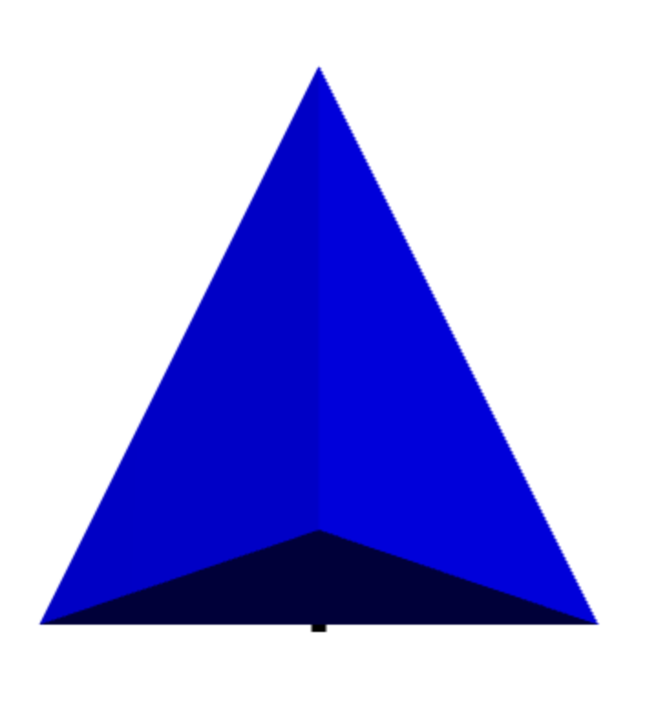
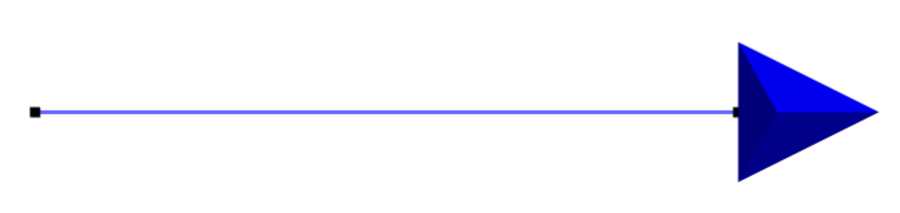
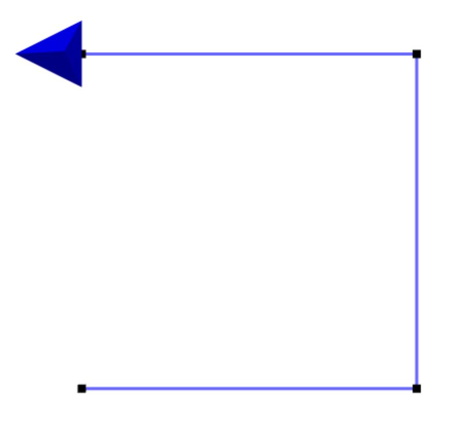
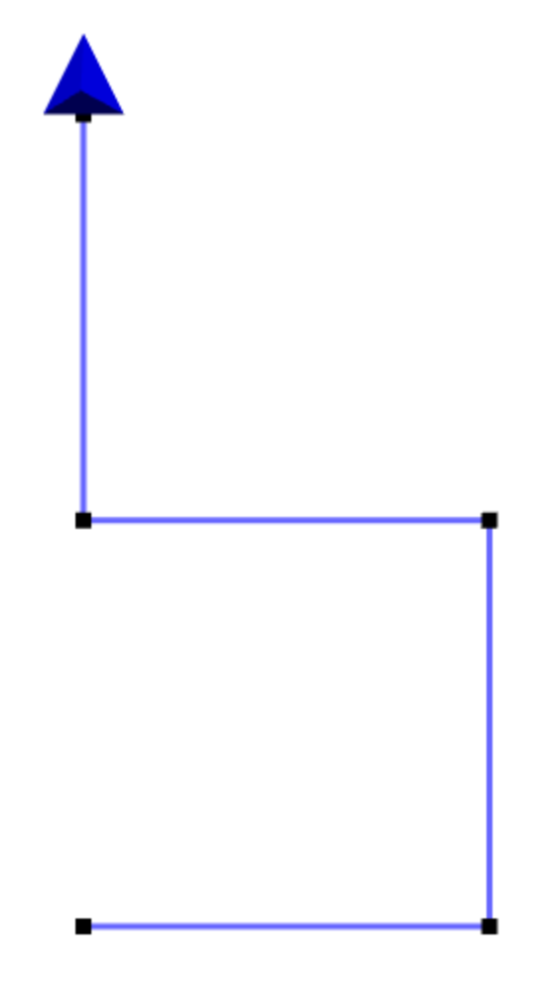

#Madeup
Madeup is a programming language for generating 3D models---it is a language for makings things *up*. Its speakers use commands like `move` and `yaw` to walk paths through space. These paths trace the cross sections or skeletons of solid models. They then use commands like `extrude` or `revolve` to generate a solid model around the paths. The models can then be exported and then printed or imported in another 3D application.

Like any language, Madeup has a grammar and meaning that must be learned in order to express models. This documentation describes the language so that you can start making things up. We begin with examples. You may wish to jump straight to the [language reference](reference.html).

##Hello, Dowel
Let's build something. How about an S-shaped curve? The central mechanic of Madeup is walking paths, so we'll walk a path resembling the letter S. This will give us a feel for how to use Madeup's movement and turning commands. I encourage you to create the model yourself using [the Madeup web client](http://madeup.xyz).

We begin with simplest program possible:

{:.mup}
~~~
~~~

Sweet, huh? This code does absolutely nothing, but it's a perfectly valid Madeup program. As we add lines of code to our program, we'll keep the old ones but highlight the new ones.

We'll start on the bottom left of the S and work our way up. Let's say the bottom left appears at the origin. We jump there directly with the `moveto` command:

{:.mup}
~~~
**moveto x:0 y:0 z:0**
~~~

{:.smallimg}

An arrow shows us where we are, and that we're looking up the y-axis. I'd rather be looking right. We can `yaw` to turn that direction:

{:.mup}
~~~
moveto x:0 y:0 z:0

**yaw degrees:90**
~~~

{:.smallimg}

The blank line is not significant. I added it just to make our later code easier to read. Let's travel 5 units to make the base of the S:

{:.mup}
~~~
moveto x:0 y:0 z:0

yaw degrees:90
**move length:5**
~~~

{:.bigimg}

Note that `move` doesn't ask for a lot of information, only how much to travel. However, behind the scenes, it considers what direction we are currently facing and carries us off in that direction. We could have used `moveto x:5 y:0 z:0` to accomplish the same thing. The advantage of using `move` is that if we later decide to put our S someplace else, we only need to change the starting location in the one `moveto` command on the first line.

We're ready to go up. However, we're not facing up anymore. Let's turn left this time and move the same length as before:

{:.mup}
~~~
moveto x:0 y:0 z:0

yaw degrees:90
move length:5
**yaw degrees:-90**
**move length:5**
~~~

{:.bigimg}

Let's do the same thing to make the middle horizontal line:

{:.mup}
~~~
moveto x:0 y:0 z:0

yaw degrees:90
move length:5
yaw degrees:-90
move length:5
**yaw degrees:-90**
**move length:5**
~~~

{:.bigimg}

The code is getting a little harder to follow now. Let's add some comments to explain to the human readers of our code where we are. Comments have no effect on the output of the program.

{:.mup}
~~~
moveto x:0 y:0 z:0

yaw degrees:90
move length:5 **-- bottom horizontal**
yaw degrees:-90
move length:5 **-- right vertical**
yaw degrees:-90
move length:5 **-- middle horizontal**
~~~

Next, let's go up again, turning right this time:

{:.mup}
~~~
moveto x:0 y:0 z:0

yaw degrees:90
move length:5 -- bottom horizontal
yaw degrees:-90
move length:5 -- right vertical
yaw degrees:-90
move length:5 -- middle horizontal
**yaw degrees:90**
**move length:5 -- left vertical**
~~~

{:.bigimg}

We're almost there. One more turn and move:

{:.mup}
~~~
moveto x:0 y:0 z:0

yaw degrees:90
move length:5 -- bottom horizontal
yaw degrees:-90
move length:5 -- right vertical
yaw degrees:-90
move length:5 -- middle horizontal
yaw degrees:90
move length:5 -- left vertical
**yaw degrees:90**
**move length:5 -- top horizontal**
~~~

{:.bigimg}

The path is complete. Our next step is to turn it into a solid. To do this, we pick one of Madeup's several solidifiers. Let's use `dowel`, which interprets our path as a skeleton around which it generates a solid dowel structure. We add the line and then hit the `Solidify` button.

{:.mup}
~~~
moveto x:0 y:0 z:0

yaw degrees:90
move length:5 -- bottom horizontal
yaw degrees:-90
move length:5 -- right vertical
yaw degrees:-90
move length:5 -- middle horizontal
yaw degrees:90
move length:5 -- left vertical
yaw degrees:90
move length:5 -- top horizontal

**dowel**
~~~

{:.bigimg}

Let's smooth out those bends a bit so that we turn no more than 1 degree at a time:

{:.mup}
~~~
moveto x:0 y:0 z:0

yaw degrees:90
move length:5 -- bottom horizontal
yaw degrees:-90
move length:5 -- right vertical
yaw degrees:-90
move length:5 -- middle horizontal
yaw degrees:90
move length:5 -- left vertical
yaw degrees:90
move length:5 -- top horizontal

**dowel maxBend:1**
~~~

{:.bigimg}

Finally, let's go from a square dowel to a round dowel by tweaking the special `nsides` variable:

{:.mup}
~~~
moveto x:0 y:0 z:0

yaw degrees:90
move length:5 -- bottom horizontal
yaw degrees:-90
move length:5 -- right vertical
yaw degrees:-90
move length:5 -- middle horizontal
yaw degrees:90
move length:5 -- left vertical
yaw degrees:90
move length:5 -- top horizontal

**nsides = 30**
dowel maxBend:1
~~~

{:.bigimg}

In the examples above, we named our parameters. That's not strictly necessary, but it may help others understand your code. Omitting the names yields the same model:

{:.mup}
~~~
moveto 0, 0, 0

yaw 90
move 5 -- bottom horizontal
yaw -90
move 5 -- right vertical
yaw -90
move 5 -- middle horizontal
yaw 90
move 5 -- left vertical
yaw 90
move 5 -- top horizontal

nsides = 30
dowel 1
~~~

{:.bigimg}

##Next
You've seen the `dowel` solidifier. Let's now check out [`extrude`](extrude.html).

----------------------------------------------------------------------------------

{:style="text-align: center"}
[Home](introduction.html)
[Next](extrude.html){:.floatright}
